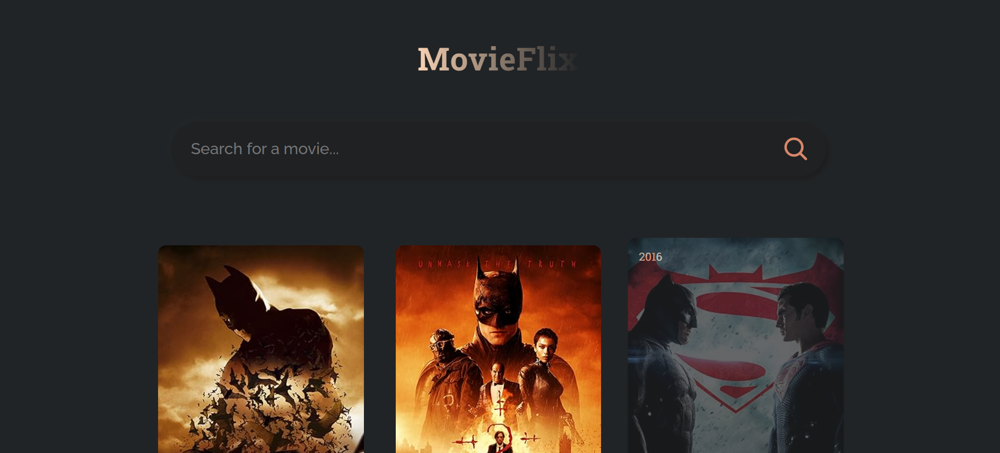
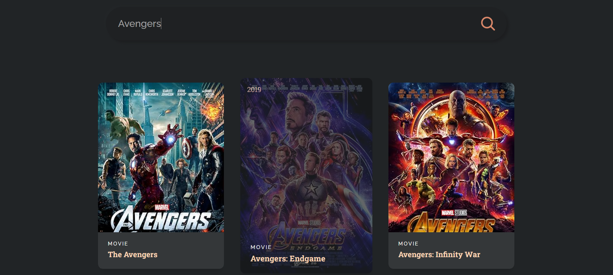

# 🎬 Movie Search App

## 🌟 Overview

MovieFlix is a dynamic **Movie Search Application** built with **React.js**, allowing users to search for movies and view relevant details. It integrates the **OMDB API** to fetch movie data based on user inputs. Utilizes **React Hooks** for state management and dynamic content updates. Styled with responsive design principles to ensure usability across devices, making it a great beginner project for learning **API integration** and **React**.

## 🚀 Features

✅ **Search for Movies** by entering a title in the search bar.  
✅ **Real-time Movie Data** fetched from the **OMDB API**.  
✅ **React Components & Hooks** for efficient state management.  
✅ **Responsive Design** for seamless experience across devices.  
✅ **Clean and Structured Codebase** following best practices.

## 🖼 Screenshots

### 🔹 Initial Page View

### 🔹 After Searching "Avengers"

## 🛠 Technologies Used

- ⚛️ **React.js** – Component-based UI development
- 🎨 **CSS** – Styling and responsiveness
- 🌐 **OMDB API** – Fetching movie details
- 🏗 **JavaScript (ES6+)** – Logic and interactions

---

✨ _Feel free to contribute and enhance the app!_ 🚀
